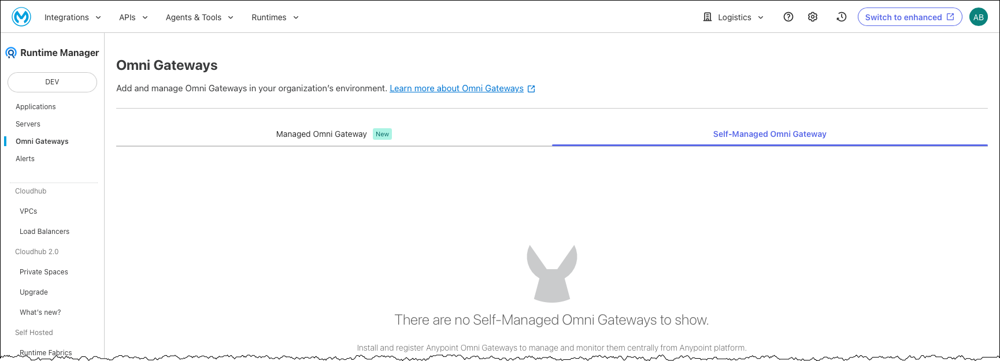
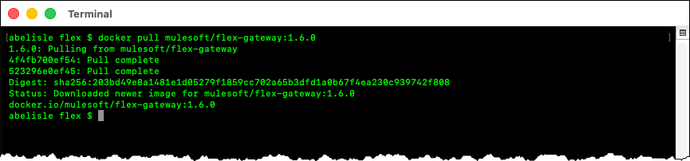
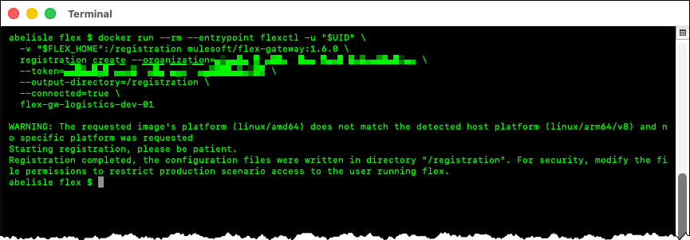
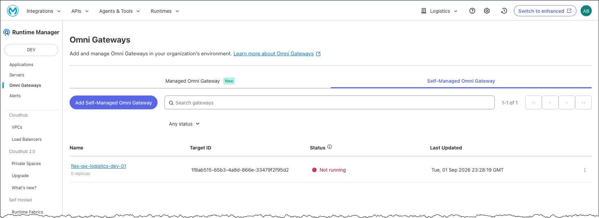
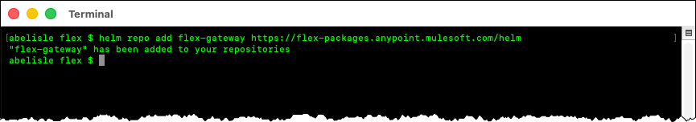
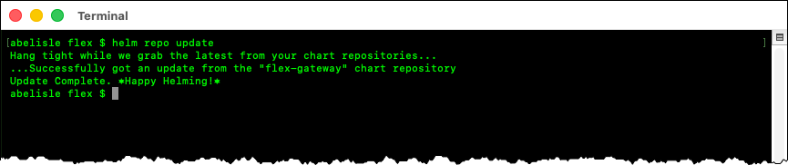
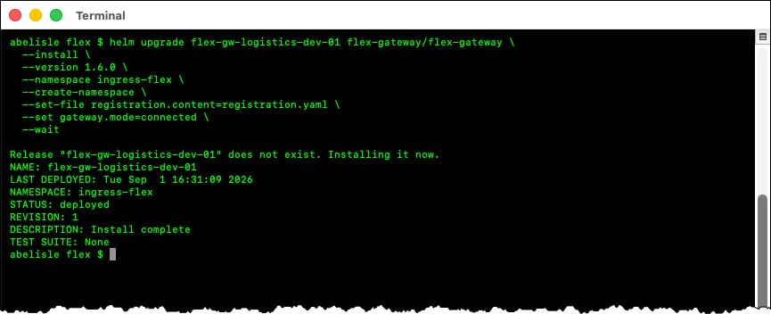
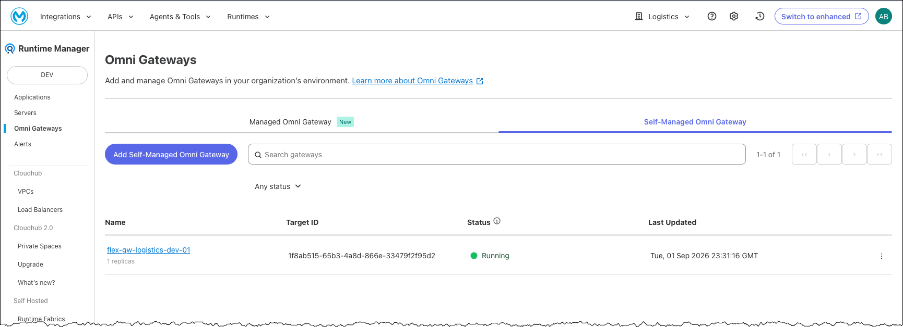
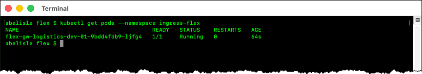

# Running Anypoint Flex Gateway Using Azure Kubernetes Service

## Introduction

### Abstract

This guide describes how to register an Anypoint Flex Gateway instance and deploy one associated replica to Azure Kubernetes Service (AKS) using client-side Docker, Azure CLI, kubectl, and Helm commands.

### Purpose

This guide complements rather than replaces the MuleSoft product documentation. The MuleSoft article [Getting Started with Flex Gateway in a Kubernetes Cluster](https://docs.mulesoft.com/gateway/latest/flex-gateway-k8-getting-started) provides the primary procedure for running Flex Gateway on Kubernetes or OpenShift. This guide provides additional explanations of the workflow, commands, configuration choices, and interactions among Anypoint Runtime Manager, the client-side tools, and AKS.

### Scope

Although this revision is pinned to Flex Gateway 1.6.0, this guide applies to Flex Gateway versions 1.5.3 through 1.8.x, running in connected mode on an AKS cluster. This procedure registers one Flex Gateway instance and deploys one associated replica for illustrative purposes.

### Out of Scope

This guide is not intended to describe or recommend a production deployment architecture. The following subjects are outside its scope:

- Designing or configuring a production deployment, including high availability, multiple replicas, load balancing, scaling, resilience, and operational monitoring
- Provisioning, configuring, administering, or troubleshooting an AKS cluster
- Publishing APIs or configuring policies, TLS contexts, or other gateway capabilities
- Installing, configuring, administering, or troubleshooting Docker, Azure CLI, kubectl, or Helm
- Configuring Azure identities, role assignments, subscriptions, or network connectivity

### Terminology

The following terms are used throughout this guide.

| Term | Definition |
| --- | --- |
| **Flex Gateway instance** | A logical gateway registered with Anypoint Platform. Each instance belongs to a specific Anypoint organization or business group and environment and groups one or more Flex Gateway replicas. |
| **Flex Gateway replica** | A running copy of Flex Gateway associated with a registered instance by using that instance's registration file. |
| **Helm chart** | A package containing the Kubernetes resource templates and default configuration values used to deploy Flex Gateway. |
| **Helm release** | An installation of the Flex Gateway Helm chart in a Kubernetes cluster. In this guide, the Helm release creates the Kubernetes resources that run the Flex Gateway replica. |
| **Registration file** | The `registration.yaml` file generated by the `flexctl registration create` command. It is specific to the registered instance and the Anypoint organization or business group and environment in which the instance was registered. The same file can be used to associate multiple replicas with the instance. |

> [!IMPORTANT]
> The registration file contains sensitive information. Store it securely and never commit it to a Git repository.

### Conventions

This guide uses `FLEX_HOME` as a shell variable representing the directory on the local computer where the registration and configuration files associated with the Flex Gateway instance are stored. `FLEX_HOME` is a convention used by this guide and is not a Flex Gateway configuration property.

The examples set `FLEX_HOME` to `$HOME/flex`, a directory named `flex` under the current user's home directory. Step 1 creates this directory. Unless otherwise stated, subsequent Flex Gateway commands run from this directory in a Bash-compatible shell on the local workstation. The examples show Docker commands without `sudo`. Prefix them with `sudo` when required by the local Docker configuration.

### Tooling Model

The procedure uses several tools across the local workstation, Anypoint Platform, and the AKS cluster.

| Tool or platform | Location | Purpose |
| --- | --- | --- |
| Anypoint Runtime Manager | Web browser | Select the Anypoint organization and environment, generate the registration command, and verify the instance and replica. |
| Docker | Local workstation | Run the containerized flexctl utility to register the Flex Gateway instance and create its registration file. Docker does not run the gateway replica. |
| Azure CLI | Local workstation | Authenticate with Azure, select the subscription, and retrieve credentials for the AKS cluster. |
| kubectl | Local workstation | Verify access to the AKS cluster and inspect the deployed Kubernetes resources. |
| Helm | Local workstation | Add the Flex Gateway chart repository and install or upgrade the Flex Gateway release. |
| AKS | Azure | Run the Kubernetes resources that comprise the Flex Gateway replica. |

### Prerequisites

Before beginning, ensure that the following requirements are met:

#### Local Workstation

* A local workstation with a Bash-compatible shell.
* Docker Engine or Docker Desktop installed and running.
* Azure CLI installed.
* kubectl installed.
* Helm installed.
* Outbound connectivity to Anypoint Platform, Azure, Docker Hub, and the Flex Gateway Helm chart repository.

#### Azure and AKS

* An existing AKS cluster.
* Access to the Azure subscription containing the cluster.
* Permission to authenticate with Azure CLI and retrieve the AKS cluster credentials.
* Kubernetes permissions to install the Flex Gateway Helm chart, including permission to create cluster-scoped custom resource definitions and namespaced resources.
* Support for provisioning a Kubernetes `Service` of type `LoadBalancer`.
* Outbound connectivity from the AKS cluster to the Anypoint control plane and required MuleSoft container registries.

#### Anypoint Platform

* Access to the appropriate Anypoint organization or business group and environment.
* Permission to register a Flex Gateway instance in the selected Anypoint organization or business group and environment.

## Running on AKS

### Prologue

This guide follows the high-level process presented in Anypoint Runtime Manager for adding and running Flex Gateway on Kubernetes. This approach preserves the essential values prepopulated in Step 2, **Register your gateway**. The guide supplements those instructions with additional information about the steps, commands, and their implied settings and configurations.

Before starting, it is crucial to understand that a Flex Gateway instance is tied to:

1. An Anypoint organization or business group.
2. An Anypoint environment, such as Dev, Sandbox, or Production.



The example uses the **Logistics** business group and the **Dev** environment. Some prepopulated values reflect those selections.

> [!NOTE]
> The examples use arbitrary component names. Choose names that follow the applicable internal naming conventions.

### Prepare the Local Environment

Before beginning, configure Azure CLI and `kubectl` on the local workstation to access the existing AKS cluster.

1. If necessary, authenticate with Azure CLI:

    ```bash
    az login
    ```

    Azure CLI typically opens a browser to complete the authentication process.


2. List the Azure subscriptions available to the authenticated account:

    ```bash
    az account list --all --output table
    ```

3. Select the subscription containing the AKS cluster:

    ```bash
    az account set --subscription "<subscription-name-or-id>"
    ```

4. Confirm the selected subscription:

    ```bash
    az account show \
      --query '{name:name,id:id,tenantId:tenantId,isDefault:isDefault}' \
      --output table
    ```

5. Retrieve the credentials for the AKS cluster:

    ```bash
    az aks get-credentials \
      --resource-group "<resource-group>" \
      --name "<aks-cluster-name>"
    ```

    The command adds the AKS cluster connection information to the active kubeconfig and sets the cluster as the current kubectl context.

6. Confirm the current kubectl context:

    ```bash
    kubectl config current-context
    ```

7. Verify access to the AKS cluster:

    ```bash
    kubectl get nodes
    ```

    Confirm that the expected AKS nodes are listed and report a status of `Ready`.

    > [!NOTE]
    > An AKS node can display `<none>` in the `ROLES` column because Kubernetes node-role labels are optional. This does not indicate a problem with the node.

### Step 1: Pull the Docker Image

Step 1 of the generic Anypoint Runtime Manager instructions pulls the Flex Gateway Docker image from Docker Hub to the local workstation.

1. Open a Bash-compatible terminal and create the `FLEX_HOME` directory—for example:

   ```bash
   export FLEX_HOME="$HOME/flex"

   mkdir -p "$FLEX_HOME"
   cd "$FLEX_HOME"
   ```

2. Pull the Flex Gateway image:

   ```bash
   docker pull mulesoft/flex-gateway:1.6.0
   ```



### Step 2: Register Your Gateway

Step 2 of the generic Anypoint Runtime Manager instructions runs the Flex Gateway Docker image to register a Flex Gateway instance with the Anypoint Platform control plane. Use the command generated by Anypoint Runtime Manager because it is prepopulated with the selected business group and environment, as discussed in the [Prologue](#prologue).

The generic command is reproduced below as a baseline for explaining its components and the recommended changes.

```bash
docker run --entrypoint flexctl -u "$UID" \
  -v "$(pwd)":/registration mulesoft/flex-gateway:1.6.0 \
  registration create --organization="<organization-id>" \
  --token="<registration-token>" \
  --output-directory=/registration \
  --connected=true \
  "<gateway-name>"
```

The following explains this command:

- The `--entrypoint` option and `flexctl` value instruct Docker to run the `flexctl` utility packaged within the container to register a new Flex Gateway instance with the Anypoint Platform control plane.

- The `-u "$UID"` option runs `flexctl` inside the container using the numeric user ID of the current local user. Consequently, the generated registration file is owned by the current user rather than by the container’s default user.

- The `-v` option creates a bind mount between a directory on the local workstation and a directory inside the container. Specifically, `"$(pwd)":/registration` maps the current host directory to `/registration` inside the container. Files written to `/registration` are therefore stored in the current host directory.

- `mulesoft/flex-gateway:1.6.0` identifies the Docker image and the specific Flex Gateway version to run.

- `registration create` is the `flexctl` subcommand that registers the Flex Gateway instance.

- The `--organization=<organization-id>` and `--token=<registration-token>` flags are parameters passed to the `flexctl registration create` command:

  - `--organization=<organization-id>` specifies the Anypoint organization or business group where the Flex Gateway instance will be registered.
  - `--token=<registration-token>` supplies the token used to authenticate the registration request. The token is associated with the Anypoint environment in which the Flex Gateway instance will be registered.

  > [!IMPORTANT]
  > Treat organization IDs and registration tokens as confidential information. These values are omitted from this document and blurred in screen captures.

- The `--output-directory=/registration` flag is a parameter passed to the `flexctl registration create` command. It identifies where to write the registration file within the container.

  As described above, the `docker run` command maps the current directory on the local workstation to `/registration` within the container. Therefore, `flexctl registration create` writes the registration file to the current directory on the local workstation.

- The `--connected=true` flag is a parameter passed to the `flexctl registration create` command. It specifies that the Flex Gateway instance will operate in connected mode.

- `<gateway-name>` specifies the name of the Flex Gateway instance.

Apply the following improvements to the generated `docker run` command:

- Add `--rm` before `--entrypoint` to dispose of the container automatically after registration completes. Without this option, Docker retains the stopped container after `flexctl` exits. The container remains on the system until it is explicitly removed.

  The first line of the command becomes:

  ```bash
  docker run --rm --entrypoint flexctl -u "$UID" \
  ```

- Instead of mounting the current directory on the local workstation to `/registration`, use a dedicated `FLEX_HOME` directory for the configuration files associated with a Flex Gateway instance and mount that directory. The second line of the command becomes:

  ```bash
  -v "$FLEX_HOME":/registration mulesoft/flex-gateway:1.6.0 \
  ```

  Using an explicit directory limits the host files exposed through the bind mount and avoids inadvertently mounting a different current directory.

The complete command, with these changes, has the following form:

```bash
docker run --rm --entrypoint flexctl -u "$UID" \
  -v "$FLEX_HOME":/registration mulesoft/flex-gateway:1.6.0 \
  registration create --organization="<organization-id>" \
  --token="<registration-token>" \
  --output-directory=/registration \
  --connected=true \
  "<gateway-name>"
```

The command above is a template. Apply these changes to the command generated by Anypoint Runtime Manager, which already contains the appropriate organization ID and registration token. Replace `<gateway-name>` with the name of the Flex Gateway instance before running the command.

The updated command is now ready to register the Flex Gateway instance with the Anypoint Platform control plane.

1. Copy the prepopulated command from Anypoint Runtime Manager and paste it into a text editor.
2. Apply the changes described above and replace `<gateway-name>` with the name of the Flex Gateway instance.
3. Run the updated `docker run` command.



The command creates a registration file named `registration.yaml` on the local workstation. This file is specific to the newly registered Flex Gateway instance and is tied to the selected Anypoint organization or business group and environment. The same registration file can associate multiple replicas with the instance.

> [!TIP]
> Save the registration file in a secure location for future use.

The command also registers the Flex Gateway instance with the Anypoint Platform control plane. The new instance becomes visible in Runtime Manager before a Flex Gateway replica is started.



### Step 3: Add Flex Gateway Helm Chart

Step 3 of the Anypoint Runtime Manager instructions adds the Helm repository containing the Flex Gateway chart. This guide performs this and subsequent Helm operations from the local workstation so that the registration and configuration files remain in the same persistent environment throughout the procedure.

1. Add the Flex Gateway Helm chart repository.

   ```bash
   helm repo add flex-gateway https://flex-packages.anypoint.mulesoft.com/helm
   ```

   


2. Update the local chart information from the configured Helm repositories.

   ```bash
   helm repo update
   ```

   


#### Optional: Review the Default Helm Chart Values

Display the Flex Gateway chart's default values:

```bash
helm show values flex-gateway/flex-gateway \
  --version 1.6.0
```

The default values can also be saved to a file for use as a reference when creating a custom values file:

```bash
helm show values flex-gateway/flex-gateway \
  --version 1.6.0 > flex-gateway-1.6.0-values.yaml
```

> [!TIP]
> The Flex Gateway Helm chart and its default values are also available on [Artifact Hub](https://artifacthub.io/packages/helm/flex-gateway/flex-gateway). When following this guide, review [chart version 1.6.0](https://artifacthub.io/packages/helm/flex-gateway/flex-gateway/1.6.0).

### Step 4: Deploy and Connect the Gateway

Step 4 of the Anypoint Runtime Manager instructions deploys a Flex Gateway replica to the AKS cluster using Helm and the registration file created in Step 2.

#### Optional: Create a Custom Values File

Create a custom values file containing only the settings that need to be overridden. Keeping the file focused on explicit overrides makes it easier to review and maintain across chart upgrades.

Custom values can override many of the Helm chart defaults. A common use case is to expose additional ports through the Kubernetes Service, making them available when registering and deploying APIs to the Flex Gateway instance.

```yaml
service:
  extraPorts:
    - name: http-0
      port: 8080
      protocol: TCP
    - name: http-1
      port: 8081
      protocol: TCP
    - name: http-2
      port: 8082
      protocol: TCP
```

This example exposes ports 8080, 8081, and 8082 through the Kubernetes Service. Exposing these ports does not automatically cause Flex Gateway to listen on them. Flex Gateway begins listening on a port when an API is deployed with a downstream configuration that uses that port. Replace or extend these example mappings based on the ports intended for APIs managed by the Flex Gateway instance.

Use a descriptive filename that associates the custom values file with the Flex Gateway instance—for example, `<gateway-name>-custom-values.yaml` or `flex-gw-logistics-dev-01-custom-values.yaml`.

#### Deploy and Connect the Replica

The generic Helm command generated by Anypoint Runtime Manager is reproduced below as a baseline for explaining its components and the recommended changes.

```bash
helm --namespace gateway upgrade --install --create-namespace --wait ingress \
  flex-gateway/flex-gateway \
  --set-file registration.content=registration.yaml \
  --set gateway.mode=connected
```

The following explains the command:

- `--namespace gateway` runs the operation in the `gateway` namespace.
- `upgrade` instructs Helm to upgrade the named release.
- `--install` instructs Helm to install the release if it does not already exist.
- `--create-namespace` creates the `gateway` namespace if it does not already exist.
- `--wait` waits for the deployed resources to reach a ready state before reporting the release as successful.
- `ingress` is the Helm release name used in the Runtime Manager instructions.
- `flex-gateway/flex-gateway` identifies the Helm repository and chart to install or upgrade.
- `--set-file registration.content=registration.yaml` sets the chart's `registration.content` value to the contents of the registration file created in Step 2.
- `--set gateway.mode=connected` sets the chart's `gateway.mode` value to `connected`.

Apply the following improvements to the generated command:

- For easier correlation, use the Flex Gateway instance name as the Helm release name. The example uses `flex-gw-logistics-dev-01`.
- Pin the Helm chart version. Chart version `1.6.0` deploys Flex Gateway `1.6.0`.
- Use a descriptive namespace, such as `flex-gateway`, `ingress-flex`, or `ingress-flex-gateway`.
- If a custom values file was created, add it using `--values <custom-values-file>.yaml`.
- Retain the long-form options, and reorganize the command to make its structure easier to read and maintain—for example, by placing each option on a separate line.

The complete command, with these changes, has the following form:

```bash
helm upgrade flex-gw-logistics-dev-01 flex-gateway/flex-gateway \
  --install \
  --version 1.6.0 \
  --namespace ingress-flex \
  --create-namespace \
  --values flex-gw-logistics-dev-01-custom-values.yaml \
  --set-file registration.content=registration.yaml \
  --set gateway.mode=connected \
  --wait
```

The example command includes `--values flex-gw-logistics-dev-01-custom-values.yaml` to apply the custom values shown above. Omit this option when no custom values file is used.

1. Copy the generated command from Anypoint Runtime Manager or the completed template above into a text editor.
2. Apply the changes described above and confirm the namespace, release name, registration filename, and optional values filename.
3. Run the updated Helm command.



Because the command includes `--wait`, Helm waits for the deployed resources to become ready before reporting the release as successful. The operation can take several minutes, depending on container-image downloads and Azure resource provisioning. By default, Helm reports a timeout if the resources do not become ready within five minutes.

### Step 5: View in Anypoint Platform

In Step 5, verify that the Flex Gateway replica connected successfully to the Anypoint Platform control plane.

1. Return to Runtime Manager in the web browser.
2. Select **Flex Gateways** from the navigation menu.
3. Confirm that the Flex Gateway instance is connected and reports one replica.



#### Optional: Verify the Deployment in the AKS Cluster

Verify that the Flex Gateway pod is running.

```bash
kubectl get pods --namespace ingress-flex
```



Confirm that the pod associated with the `flex-gw-logistics-dev-01` Helm release reports `Running` and is ready.

Display the Kubernetes Service created for the gateway.

```bash
kubectl get service flex-gw-logistics-dev-01 \
  --namespace ingress-flex
```

If a custom values file was used, verify that the deployed Kubernetes resources reflect the intended overrides. The resources to inspect depend on the settings changed. For example, use the following command to review the Service.

```bash
kubectl describe service flex-gw-logistics-dev-01 \
  --namespace ingress-flex
```

Confirm that the Service reflects any service-related overrides, such as additional ports.

## Conclusion

This guide demonstrated how to register a Flex Gateway instance and deploy one associated replica to an AKS cluster using Helm. It also explained the principal Docker, `flexctl`, and Helm options used in the commands generated by Anypoint Runtime Manager.

---

Copyright © 2026 Alan Belisle. Licensed under the [Apache License 2.0](../LICENSE.txt).
