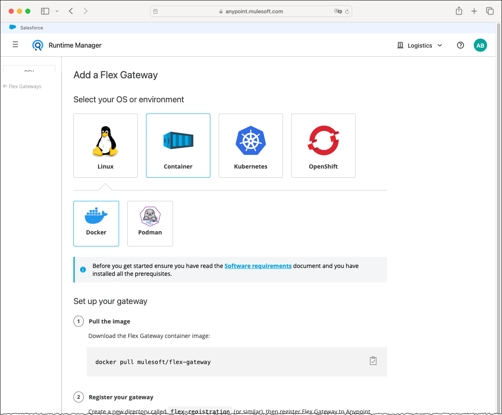
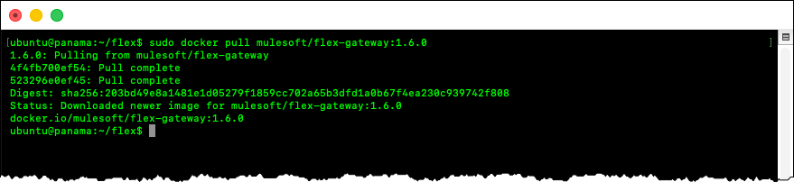
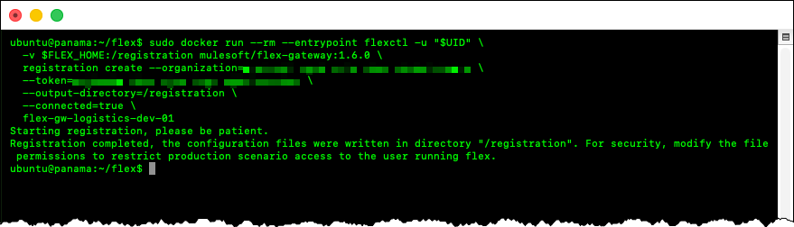
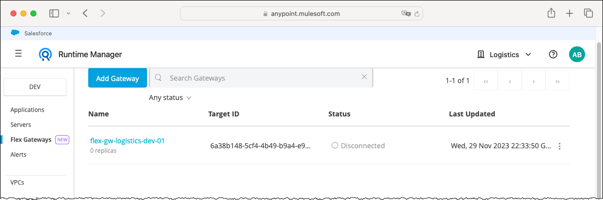
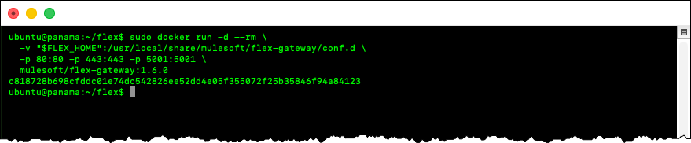
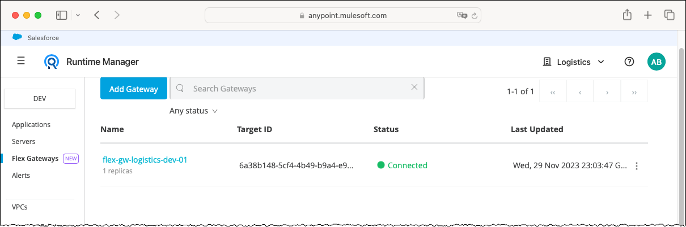

# Running Anypoint Flex Gateway Using Docker Engine on Linux

## Introduction

### Abstract

This guide describes how to register and run Anypoint Flex Gateway using Docker Engine on Linux.

### Purpose

This guide complements rather than replaces the MuleSoft product documentation. It expands on the registration and startup procedures and explains Docker and `flexctl` command-line options used in the instructions generated by Anypoint Runtime Manager, several of which are not described in detail in the product documentation.

### Scope

This guide applies to Flex Gateway versions 1.5.3 through 1.8.x, running in connected mode as a Docker container on Linux. It uses the `flexctl registration create` command introduced in version 1.5.3. Earlier versions use different registration syntax and are outside the scope of this guide.

The procedure registers one Flex Gateway instance and starts one associated replica for illustrative purposes. It was validated using the following combinations:

- Flex Gateway 1.6.0 on Ubuntu 26.04 LTS
- Flex Gateway 1.8.3 on Red Hat Enterprise Linux 9.8

### Out of Scope

This guide is not intended to describe or recommend a production deployment architecture. The following subjects are outside its scope:

- Designing or configuring a production deployment, including high availability, multiple replicas, load balancing, scaling, resilience, and operational monitoring
- Installing, configuring, administering, or troubleshooting Linux
- Installing, configuring, administering, or troubleshooting Docker Engine
- Publishing APIs or configuring policies, TLS contexts, or other gateway capabilities

### Terminology

The following terms are used throughout this guide.

| Term | Definition |
| --- | --- |
| **Flex Gateway instance** | A logical gateway registered with Anypoint Platform. Each instance belongs to a specific Anypoint organization or business group and environment and groups one or more Flex Gateway replicas. |
| **Flex Gateway replica** | A running copy of Flex Gateway associated with a registered instance by using that instance's registration file. |
| **Registration file** | The `registration.yaml` file generated by the `flexctl registration create` command. It is specific to the registered instance and the Anypoint organization or business group and environment in which the instance was registered. The same file can be used to associate multiple replicas with the instance. |

> [!IMPORTANT]
> The registration file contains sensitive information. Store it securely and never commit it to a Git repository.

### Conventions

This guide uses `FLEX_HOME` as a shell variable representing the directory on the Linux host where the registration and configuration files associated with the Flex Gateway instance are stored. `FLEX_HOME` is a convention used by this guide and is not a Flex Gateway configuration property.

The examples set `FLEX_HOME` to `$HOME/flex`, a directory named `flex` under the current user's home directory. Using `$HOME` avoids relying on a user-specific absolute path. Unless otherwise stated, all references to `FLEX_HOME` in this guide assume this value.

### Prerequisites

Before beginning, ensure that the following requirements are met:

* A supported Linux host with Docker Engine installed and running.
* Permission to run Docker commands directly or through `sudo`.
* Outbound network connectivity to the Anypoint control plane and the container registry hosting the Flex Gateway image.
* Access to the appropriate Anypoint organization or business group and environment.
* Permission to register a Flex Gateway instance in the selected Anypoint organization or business group and environment.
* Inbound traffic to the ports used by API clients to reach Flex Gateway is permitted by the Linux host firewall and any surrounding network controls.

## Running on Docker Engine

### Prologue

This guide follows the high-level process presented in Anypoint Runtime Manager for adding and running Flex Gateway using Docker Engine. This approach preserves the essential values prepopulated in step 2, **Register your gateway**. The guide supplements those high-level instructions with additional information about the steps, commands, and their implied settings and configurations.

Before starting, it is crucial to understand that a Flex Gateway instance is tied to:

1. An Anypoint organization or business group.
2. An Anypoint environment, such as Dev, Sandbox, or Production.



The example in the screen capture uses the **Logistics** business group and the **Dev** environment. Some prepopulated values reflect those selections.

> [!NOTE]
> The examples use arbitrary component names. Choose names that follow the applicable internal naming conventions.

### Step 1: Pull the Image

Step 1 of the Anypoint Runtime Manager generic instructions consists of downloading the Docker image of Flex Gateway from Docker Hub.

1. Connect to the Linux host using SSH and change to the `FLEX_HOME` directory—for example:

   ```bash
   export FLEX_HOME="$HOME/flex"

   mkdir -p "$FLEX_HOME"
   cd "$FLEX_HOME"
   ```

2. Pull the Flex Gateway image:

   ```bash
   sudo docker pull mulesoft/flex-gateway:1.6.0
   ```



### Step 2: Register Your Gateway

Step 2 of the generic Anypoint Runtime Manager instructions runs the Flex Gateway Docker image to register a Flex Gateway instance with the Anypoint Platform control plane. Use the command generated by Anypoint Runtime Manager because it is prepopulated with the selected business group and environment, as discussed in the [Prologue](#prologue).

The generic command is reproduced below as a baseline for explaining its components and the recommended changes.

```bash
sudo docker run --entrypoint flexctl -u "$UID" \
  -v "$(pwd)":/registration mulesoft/flex-gateway:1.6.0 \
  registration create --organization="<organization-id>" \
  --token="<registration-token>" \
  --output-directory=/registration \
  --connected=true \
  "<gateway-name>"
```

The following explains this command:

- The `--entrypoint` option and `flexctl` value instruct Docker to run the `flexctl` utility packaged within the container to register a new Flex Gateway instance with the Anypoint Platform control plane.

- The `-u "$UID"` option runs `flexctl` inside the container using the numeric user ID of the current Linux user. Because the shell expands `$UID` before sudo runs Docker, the value still identifies the current user rather than root. Consequently, the generated registration file is owned by the current user instead of root.

- The `-v` option creates a bind mount between a directory on the Linux host and a directory inside the container. Specifically, `"$(pwd)":/registration` maps the current host directory to `/registration` inside the container. Files written to `/registration` are therefore stored in the current host directory.

- `mulesoft/flex-gateway:1.6.0` identifies the Docker image and the specific Flex Gateway version to run.

- `registration create` is the `flexctl` subcommand that registers the Flex Gateway instance.

- The `--organization=<organization-id>` and `--token=<registration-token>` flags are parameters passed to the `flexctl registration create` command:

  - `--organization=<organization-id>` specifies the Anypoint organization or business group where the Flex Gateway instance will be registered.
  - `--token=<registration-token>` supplies the token used to authenticate the registration request. The token is associated with the Anypoint environment in which the Flex Gateway instance will be registered.

  > [!IMPORTANT]
  > Treat organization IDs and registration tokens as confidential information. These values are omitted from this document and blurred in screen captures.

- The `--output-directory=/registration` flag is a parameter passed to the `flexctl registration create` command. It identifies where to write the registration file within the container.

  As described above, the `docker run` command maps the current directory on the Linux host to `/registration` within the container. Therefore, `flexctl registration create` writes the registration file to the current directory on the Linux host.

- The `--connected=true` flag is a parameter passed to the `flexctl registration create` command. It specifies that the Flex Gateway instance will operate in connected mode.

- `<gateway-name>` specifies the name of the Flex Gateway instance.

Apply the following improvements to the generated `docker run` command:

- Add `--rm` before `--entrypoint` to dispose of the container automatically after registration completes. Without this option, Docker retains the stopped container after `flexctl` exits. The container remains on the system until it is explicitly removed.

  The first line of the command becomes:

  ```bash
  sudo docker run --rm --entrypoint flexctl -u "$UID" \
  ```

- Instead of mounting the current directory on the Linux host to `/registration`, use a dedicated `FLEX_HOME` directory for the configuration files associated with a Flex Gateway instance and mount that directory. The second line of the command becomes:

  ```bash
  -v "$FLEX_HOME":/registration mulesoft/flex-gateway:1.6.0 \
  ```

  Using an explicit directory limits the host files exposed through the bind mount and avoids inadvertently mounting a different current directory.

The complete command, with these changes, has the following form:

```bash
sudo docker run --rm --entrypoint flexctl -u "$UID" \
  -v "$FLEX_HOME":/registration mulesoft/flex-gateway:1.6.0 \
  registration create --organization="<organization-id>" \
  --token="<registration-token>" \
  --output-directory=/registration \
  --connected=true \
  "<gateway-name>"
```

The command above is a template. Apply these changes to the command generated by Anypoint Runtime Manager, which already contains the appropriate organization ID and registration token. Replace `<gateway-name>` with the name of the Flex Gateway instance before running the command.

The updated command is now ready to register the Flex Gateway instance with the Anypoint Platform control plane.

1. Copy the prepopulated command from Anypoint Runtime Manager and paste it into a text editor.
2. Apply the changes described above and replace `<gateway-name>` with the name of the Flex Gateway instance.
3. Run the updated `docker run` command.



The command creates a registration file named `registration.yaml` on the Linux host. This file is specific to the newly registered Flex Gateway instance and is tied to the selected Anypoint organization or business group and environment. The same registration file can associate multiple replicas with the instance.

> [!TIP]
> Save the registration file in a secure location for future use.

The command also registers the Flex Gateway instance with the Anypoint Platform control plane. The new instance becomes visible in Runtime Manager before a Flex Gateway replica is started.



### Step 3: Start the Gateway

Step 3 of the Anypoint Runtime Manager generic instructions consists of starting a Flex Gateway replica. The generic command is reproduced below as a baseline for explaining its components and the recommended changes.

```bash
sudo docker run --rm \
  -v "$(pwd)":/usr/local/share/mulesoft/flex-gateway/conf.d \
  -p 8081:8081 \
  mulesoft/flex-gateway:1.6.0
```

The following explains this command:

- The `--rm` option instructs Docker to dispose of the container automatically when it stops.

- By default, the container runs in the foreground and remains attached to the terminal. Pressing **Ctrl+C** sends an interrupt signal to the container and ordinarily stops it. Running the container in detached mode allows it to continue independently of the terminal session. Because the command includes `–rm`, Docker automatically removes the container after it stops.

- The `-v` option creates a bind mount from the current directory on the Linux host to `/usr/local/share/mulesoft/flex-gateway/conf.d` inside the container. The registration file and other optional configuration files present in the current directory become available to start and configure the Flex Gateway replica.

- The generated command includes the -p 8081:8081 option, which publishes container port 8081 as port 8081 on the Linux host. Retain this mapping if the APIs managed by the Flex Gateway instance use container port 8081 for inbound requests.

  If an API is configured to listen on a different container port, add or replace the mapping using this syntax:

  ```text
  -p <host-port>:<container-port>
  ```

  The host port is the port used by API clients to reach the Linux host. The container port must match the inbound port configured for the API in Flex Gateway.

  For example, the following mapping allows clients to connect to port 8080 on the Linux host while Flex Gateway receives the requests on container port 8081:

  ```text
  -p 8080:8081
  ```

  Publishing a port with Docker only forwards traffic to the container. It does not configure Flex Gateway or an API to listen on that port.

- `mulesoft/flex-gateway:1.6.0` identifies the Docker image and the specific Flex Gateway version to run.

Apply the following improvements to the generated `docker run` command:

- Add `-d` before `--rm` to run the container in detached mode—as a background process. When you do so, Docker no longer writes the container's output directly to the attached terminal.

  > [!TIP]
  > Omit `-d` when starting the first Flex Gateway replica. Running it in the foreground writes log messages to the terminal, which can help troubleshoot issues.

- Instead of mounting the current directory, mount `FLEX_HOME` to the Flex Gateway configuration directory:

  ```bash
  -v "$FLEX_HOME":/usr/local/share/mulesoft/flex-gateway/conf.d \
  ```

The complete command, with these changes, is:

```bash
sudo docker run -d --rm \
  -v "$FLEX_HOME":/usr/local/share/mulesoft/flex-gateway/conf.d \
  -p 8081:8081 \
  mulesoft/flex-gateway:1.6.0
```

The updated command is now ready to start a Flex Gateway replica.

1. Copy the updated command above or the prepopulated command from Runtime Manager and paste it into a text editor to make any necessary changes.
2. Apply the changes described above.
3. Run the updated `docker run` command.



### Step 4: View in Anypoint Platform

In step 4, verify that the Flex Gateway replica connected successfully to the Anypoint Platform control plane.



## Conclusion

This guide demonstrated how to register a Flex Gateway instance and start one associated replica using Docker Engine on Linux. It also explained the principal Docker and `flexctl` options used in the commands generated by Anypoint Runtime Manager.
